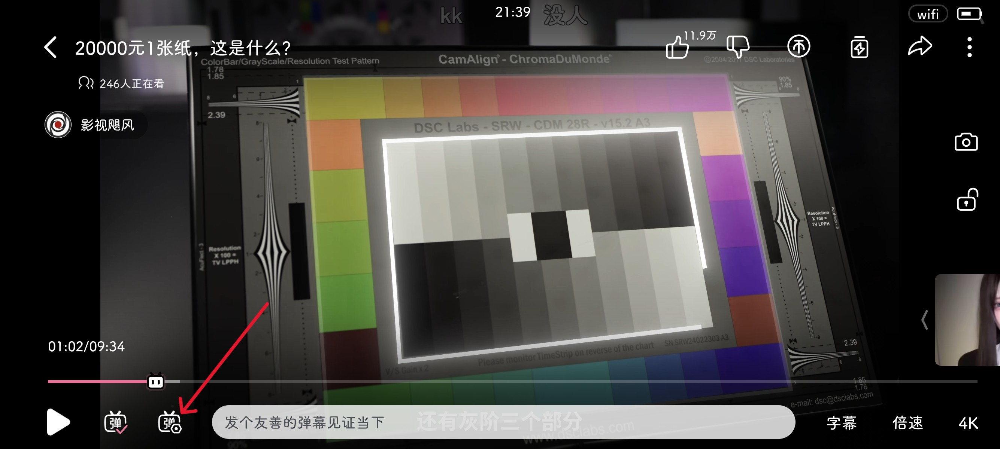
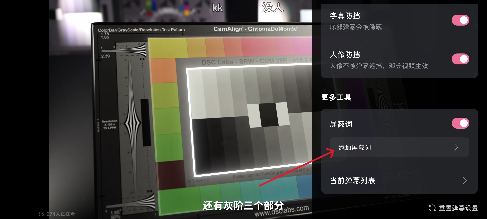
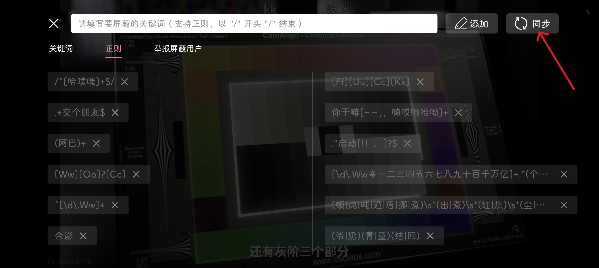

# bilibili-danmu-block-list

[](https://github.com/astral-sh/uv)


本仓库收集哔哩哔哩弹幕屏蔽规则。

查看 [规则清单.md](rules.md) | [规则清单.json](bilibili-danmu-blocklist.json)

## 使用说明

> [!NOTE]
>
> 以下操作均在 web 端进行。

### 如何导入规则

1. 前往 [Release](https://github.com/Snoopy1866/bilibili-danmu-block-list/releases/latest) 下载名为 `bilibili-danmu-blocklist-output.json` 的最新版规则文件。

2. 进入任意哔哩哔哩视频页面，点击 `弹幕列表` 右侧的 ⠇，选择 `屏蔽设定`：
   

3. 在内容空白处右键，选择 `导入json文件`：
   

4. 在弹出的窗口中，找到在步骤 1 中下载的 json 文件，点击 `打开` 即可。

### 如何清空规则

分别切换到 `屏蔽文本`、`屏蔽正则` 标签，按 `F12` 打开开发者工具，在 `控制台` 中执行以下代码：

```javascript
document
  .querySelectorAll("span.bpx-player-block-list-delete")
  .forEach((button) => {
    button.click();
  });
```

### 如何同步规则

分别切换到 `屏蔽文本`、`屏蔽正则` 标签，按 `F12` 打开开发者工具，在 `控制台` 中执行以下代码：

```javascript
document
  .querySelectorAll("span.bpx-player-block-list-sync")
  .forEach((button) => {
    button.click();
  });
```

如果出现下图中部分规则未上传的情况，请尝试重复执行上述代码，大部分情况下均可以上传成功。


> [!TIP]
>
> 上传成功后，可以在移动端 app 内打开任意视频，进入全屏，点击左下角 `弹幕设置`，进入 `更多工具` -> `添加屏蔽词`，点击右上角 `同步`，即可将 web 端设置的屏蔽规则同步到 app 端，具体操作步骤如下：
>
> 
>
> 
>
> 

> [!WARNING]
>
> 存在少数无法上传的规则，原因未知，这些规则只能单独在 web 端使用，例如：
>
> - `(?<!乾)坤`
> - `(没|难)?((?<!鹬)蚌|崩|绷)(埠|不)?(住)?(了)?`

> [!WARNING]
>
> 尽管通过上述方式可以将 web 端的规则可以同步到移动端，但实际上仍然存在部分规则无法在移动端生效的情况，原因未知。

## 贡献指南

推荐使用 [VSCode](https://code.visualstudio.com/Download) 编辑规则文件。

前置要求

- [Python](https://www.python.org/downloads) >= 3.12
- [Git](https://git-scm.com/downloads) >= 2.45
- [uv](https://docs.astral.sh/uv/getting-started/installation) >= 0.5.9

1. 克隆本仓库

   ```bash
   git clone https://github.com/Snoopy1866/bilibili-danmu-block-list.git
   ```

2. 初始化项目

   ```bash
   uv sync
   ```

3. 新建一个分支，名称任意（例如：`feat`）

   ```bash
   git checkout -b feat
   ```

4. 修改 `bilibili-danmu-blocklist.json`

5. 提交更改并推送

   ```bash
   git add .
   git commit -m "feat: update rules"
   git push origin feat
   ```

6. 发起 Pull Request

### `bilibili-danmu-blocklist.json` 字段解释

#### 哔哩哔哩识别的字段：

| 名称   | 含义           | 类型      | 必要性     | 取值          |
| ------ | -------------- | --------- | ---------- | ------------- |
| type   | 规则类型       | _int_     | _required_ | [0,1,2]       |
| filter | 规则内容       | _string_  | _required_ | _Any_         |
| opened | 规则是否启用   | _boolean_ | _required_ | true \| false |
| id     | 规则唯一标识符 | _int_     | _optional_ | _Any_         |

#### 本仓库添加的字段：

| 名称            | 含义         | 类型            | 必要性     | 可选值 |
| --------------- | ------------ | --------------- | ---------- | ------ |
| description     | 规则描述     | _string_        | _optional_ | _Any_  |
| examples        | 规则匹配示例 | _Array[string]_ | _optional_ | _Any_  |
| excludeExamples | 规则排除示例 | _Array[string]_ | _optional_ | _Any_  |

> [!NOTE]
>
> 1. `excludeExamples` 字段用于辅助正则表达式的编写，尽可能避免错杀正常弹幕。
> 2. `description` 字段暂未启用，后续可能会移除。

> [!IMPORTANT]
>
> 1. 请不要添加 `type=2` 的规则，这类规则用于屏蔽指定 UID 的用户发出的弹幕，你应该自行添加这类规则，而不是在公共仓库中添加。
> 2. 请不要添加 `id` 字段，该字段会在你提交 PR 后根据当前时间戳（精确到纳秒）自动生成。
> 3. 添加或修改 `屏蔽正则` 类型的规则需注意：
>    - 使用 `\\` 代替 `\`，例如：使用 `\\d+` 代替 `\d+`，这是因为 json 字符串本身需要对字符 `\` 进行转义
>    - 不要使用类似 `(阿巴)*` 这样的正则表达式，在缺少定位符 `^` 或 `$` 的情况下使用 `*` 会导致所有弹幕都被屏蔽

## 相关链接

- [正则表达式指南](https://docs.python.org/zh-cn/3.13/howto/regex.html)
- [正则表达式可视化](https://jex.im/regulex)
- [正则表达式测试](https://www.jyshare.com/front-end/854)

## 类似的仓库

- https://github.com/jnxyp/Bilibili-Block-List
- https://github.com/zornlemma/bilibili_RE_block_list
- https://github.com/fang2hou/Bilibili-block-list
